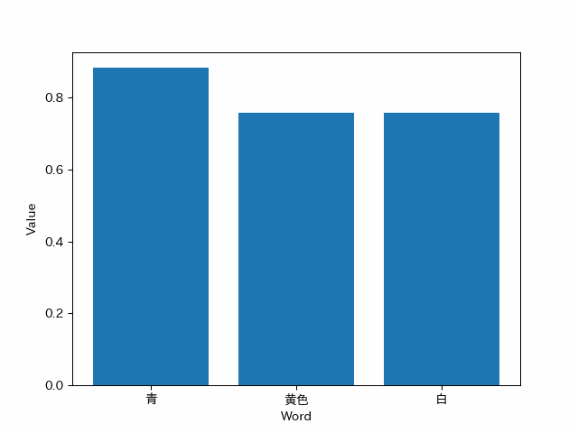

この実験は、選択的転移強化学習において転移先の強化学習済み知識が存在しない状態で行われる実験である。

目的は、転移先が用意された場合において、どのように転移が可能かを検討し、基盤となるSAP-netの実現可能性を判断することだ。

# ネットワークの作成と可視化
まずはネットワークの可視化方法をPythonで試していく
```Python
%matplotlib inline
import networkx as nx # NetworkXをインポート
import matplotlib.pyplot as plt
import numpy as np

# ネットワーク生成
G = nx.Graph([(1, 2), (2, 3), (3, 1)])
# G = nx.Graph() # 空のグラフを作成する場合
nx.draw(G, with_labels=True) # ラベルをTrueにして番号の可視化
```


ノードの追加方法を検証
```Python
G.add_node(4)
nx.draw(G, with_labels=True)V
```


リンクの追加方法を検証
```Python
G.add_edge(1,4)
nx.draw(G, with_labels=True)
```


複数ノードと複数リンクの追加方法を検証
```Python
# 複数ノードの追加
n = [5, 6, 7]
G.add_nodes_from(n)

# 複数リンクの追加
e = [(5,6), (3,7), (4,6)]
G.add_edges_from(e)

nx.draw(G, with_labels=True)
```


ノードの削除方法を検証
```Python
G.remove_node(4)
nx.draw(G, with_labels=True)
```


複数リンクの削除方法を検証
```Python
G.remove_edges_from([(1,2), (2,3)])
nx.draw(G, with_labels=True)
```


# 画像認識の検証
Yoroのパッケージをインストールして階層構造を構築してから下記のプログラムを実行
画像の表示までできるようになった
```Python
# pillowをインポート
from PIL import Image

# 画像パス
filename = r"C:\Users\DE\Documents\Github\Intelligent_Information_System_Lab_research\Yoro_test\sample_img\sample_dog.jpg"

# Pillowで開く
im = Image.open(filename)

# 表示
im
```


実際に画像を読み取り、Yoroモデルに画像を渡し物体認証してみる
```Python
# pillowをインポート
from PIL import Image

# 画像パス
filename = r"C:\Users\DE\Documents\Github\Intelligent_Information_System_Lab_research\Yoro_test\yolov5\runs\detect\exp\sample_dog.jpg"

# Pillowで開く
im = Image.open(filename)

# 表示
im
```


# 文字列ネットワークの検証
下記のプログラムが、文字列ネットワークで作成した仮想SAP-netのプログラムである。

## フォルダ準備
文字列ネットワークを作成した際に保存する先のフォルダーを時間軸によって分岐するためのプログラム
```Python
import os
import datetime
# Get current time
current_time = datetime.datetime.now().strftime("%Y%m%d%H%M%S")
# Create output folder with the current time as part of the name
folder_name = f"./Output_{current_time}"
if not os.path.exists(folder_name):
    os.makedirs(folder_name)
```

保存先のパスを生成するためのプログラム
```Python
# 入力
input_str = input("Please enter string in SAPNet===>")
model_file_path = '../../KITERETU/gw2v160.model'

# 出力
database_path = folder_name + '/database.sqlite'
Heatmap_path = folder_name + '/heatmap.png'
Network_path = folder_name + '/network.png'
GIF_path_100 = folder_name + '/graph_100.gif'
GIF_path_1000 = folder_name + '/graph_1000.gif'
```

## モデル準備
作成した学習済みモデルをロードして使用するプログラム
```Python
import pandas as pd
from gensim.models import Word2Vec
import seaborn as sns
import pandas as pd
import numpy as np
import matplotlib as mpl
import matplotlib.pyplot as plt
import japanize_matplotlib

# 学習済みモデルのロード
model = Word2Vec.load(model_file_path)
```

## データベース準備
データベースを用意して、29万字の文字列を持ち、それらの活性化の値を保存するプログラム
```Python
from gensim.models import Word2Vec
import sqlite3


# データベースに接続し、カーソルを作成する
conn = sqlite3.connect(database_path)
cursor = conn.cursor()

# テーブルが存在しない場合のみ作成する
cursor.execute('''CREATE TABLE IF NOT EXISTS words (word TEXT, value REAL)''')

# モデル内のすべての単語と値をデータベースに保存する
for word in model.wv.key_to_index:
    cursor.execute('''INSERT INTO words VALUES (?, ?)''', (word, 0.000000))

# コミットして変更を確定する
conn.commit()

# データベース接続を閉じる
conn.close()
```

作成されたデータベースに対して、Wordや値を保存するテーブルを作成するプログラム
```Python
import sqlite3
import pandas as pd
import sqlite3

# データベースに接続する
conn = sqlite3.connect(database_path)
cursor = conn.cursor()
df = pd.read_sql_query("SELECT * FROM words", conn)

# キーを「word」列に変更する
df = df.set_index('word')
print(df)

# データベース接続を閉じる
conn.close()
```


## 類似文字生成処理
Word2Vecで作成されたモデルの全長を見て、類似の単語を算出
```Python
# モデル内に登録されている単語リストの長さをlen関数で見る（＝単語数）
print(len(model.wv.key_to_index))

# 似ている単語TOP7を書き出す
out = model.wv.most_similar(positive=[input_str], topn=10)
print(out)
```


算出された類似語を抽出
```Python
print(out)

#AtCoderでよく使う辞書処理を使って県と数値を取り出す
pre=[]
pre.append(input_str)
for prefecture, value in out:
    print(prefecture, value)
    pre.append(prefecture)
```


取り出した文字列と値を使用して、dataframeを作成し、クロステーブルを生成
```Python
import pandas as pd

df = pd.crosstab(pre, pre, rownames=['X'], colnames=['Y'])
df
```


同じインデックスを持つ値には、0を格納したい。<br>
かつ、影響度が小さすぎるものは切り落とす必要がある。<br>
そのため、1 > x >=0.6の活性値を持つ文字列のみ活性化を行った
```Python
for i in pre:
    for j in pre:
        #0を除外する処理を入れていないので計算数がその分多い
        if model.wv.similarity(i,j) >= 1.0:
            df.loc[i,j]=0.0
        elif model.wv.similarity(i,j) >= 0.6:
            df.loc[i,j]=model.wv.similarity(i,j)
        else:
            df.loc[i,j]=0
        #print(df.loc['Bob', 'age'])
        #df.iloc[1,0]
df
```


上記の文字列ネットワークにより、想起された類語をヒートマップで可視化するプログラム<br>
ヒートマップで可視化することにより、それぞれの関連性の高さが可視化された。
```Python
import seaborn as sns
import pandas as pd
import numpy as np
import matplotlib as mpl
import matplotlib.pyplot as plt
import japanize_matplotlib


plt.figure()
plt.title("入力文字列「{}」により想起された文字列の類似度ヒートマップ".format(input_str))
sns.heatmap(df,cmap="winter")
plt.savefig(Heatmap_path)
```


上記の文字列ネットワークにより、想起された類語を全網羅ネットワークで可視化するプログラム<br>
全網羅ネットワークで可視化することにより、全体でどのような繋がりがあるか可視化された<br>
ノードの大きさは接続されたすべての単語への影響度の大きさを表している<br>
辺の太さは接続された両端の単語の類似度の高さを表している

```Python
import pandas as pd
import networkx as nx
import matplotlib.pyplot as plt
import japanize_matplotlib

# ネットワークグラフの作成
G = nx.from_pandas_adjacency(df, create_using=nx.Graph)

# グラフの描画
plt.figure(figsize=(len(input_str)+8, len(input_str)+6))
pos = nx.spring_layout(G)  # ノードの位置を設定
weights = nx.get_edge_attributes(G, 'weight')

# 辺の太さを重みに応じて調整
max_weight = max(weights.values())
edge_widths = [(6 * (1 - weights[edge])) ** 2 for edge in G.edges()]

# ノードの太さを重みに応じて調整
node_sizes = [50 + 150 * G.degree(node) for node in G.nodes()]

# グラフを描画
japanize_matplotlib.japanize()
nx.draw_networkx_nodes(G, pos, node_color='lightblue', node_size=node_sizes)
nx.draw_networkx_edges(G, pos, width=edge_widths, edge_color='black')
nx.draw_networkx_labels(G, pos, font_family='IPAexGothic', font_color='black', font_size=10)
plt.title('入力文字列「{}」により想起された文字列の類似度ネットワーク'.format(input_str))
plt.axis('off')

# グラフを出力
plt.savefig(Network_path)
```


## SAP-net処理
上記の類似度ネットワークを用いて文字列類似度SAP-netを実装した。<br>
出力では、「赤」という文字列に対し、想起されていく文字列と活性値の様子を出力している
```Python
import sqlite3
import pandas as pd
import sqlite3
import matplotlib.pyplot as plt
from PIL import Image  # Import the PIL module
import io
from IPython.display import HTML
from IPython.display import display
from PIL import Image  # Import the PIL module
import glob  # Import the glob module

# Connect to the database
conn = sqlite3.connect(database_path)
cursor = conn.cursor()
ans = []
ans.append([input_str])
print(ans)
images = []
for i in range(3):
    ans.append([])
    for j in range(len(ans[i])):
        out = model.wv.most_similar(positive=[ans[i][j]], topn=3)
        for prefecture, value in out:
            ans[i + 1].append(prefecture)
            # Execute SQL query to get the numerical value
            cursor.execute("SELECT value FROM words WHERE word = ?", (prefecture,))
            result = cursor.fetchone()[0]
            new_result = result + value
            val = '{:6f}'.format(new_result)
            cursor.execute("UPDATE words SET value = ? WHERE word = ?", (val, prefecture))
        # Execute SQL query to get the result with similarity threshold of 0.5
        cursor.execute("SELECT word, value FROM words WHERE value > 0.5 ORDER BY value DESC LIMIT 10")
        results = cursor.fetchall()
        words = [result[0] for result in results]
        values = [result[1] for result in results]
        print(words)
        print(values)
        # Create the graph
        plt.bar(words, values)  # Display words on the x-axis
        plt.xlabel('Word')
        plt.ylabel('Value')
        # Create a PIL Image object from the plot
        buf = io.BytesIO()
        plt.savefig(buf, format='png')
        buf.seek(0)
        im = Image.open(buf)
        images.append(im)
        plt.clf()  # Clear the figure for the next iteration

# Save the frames as a GIF image
images[0].save(GIF_path_100, format='GIF', append_images=images[1:], save_all=True, duration=100, loop=0)
images[0].save(GIF_path_1000, format='GIF', append_images=images[1:], save_all=True, duration=1000, loop=0)

# Commit changes and close the database connection
conn.commit()
conn.close()
```


上記の文字列類似度SAP-netを実装の様子をリアルタイムで監視すべく、縦棒グラフのGIF画像を生成し、視認性を高めている
```Python
import base64
from IPython import display as dd # display関数と名前が被るので別名にしておきます。

with open(GIF_path_100, "rb") as f:
    b64 = base64.b64encode(f.read()).decode("ascii")
    
display(dd.HTML(f''))
```


```Python
#出力A
print("入力文字列「{}」".format(input_str))
import sqlite3

#出力B
# データベースに接続する
conn = sqlite3.connect(database_path)
# クエリを実行する
cur = conn.cursor()
cur.execute("SELECT word, value FROM words ORDER BY value DESC LIMIT 10")
# 結果を取得する
results = cur.fetchall()
# 結果を出力する
for word, value in results:
    print("{:7s} \t{:.6f}".format(word, value))
# データベースを切断する
conn.close()

import matplotlib.pyplot as plt

# 画像ファイルを読み込む
Heatmap_img = plt.imread(Heatmap_path)
Network_img = plt.imread(Network_path)

# グラフを描画
plt.figure(figsize=(20, 15))
plt.subplot(1, 2, 1)
plt.imshow(Heatmap_img)

plt.figure(figsize=(25, 20))
plt.subplot(1, 2, 2)
plt.imshow(Network_img)
plt.show()

#出力E
import base64
from IPython import display as dd # display関数と名前が被るので別名にしておきます。
with open(GIF_path_100, "rb") as f:
    b64 = base64.b64encode(f.read()).decode("ascii")
display(dd.HTML(f''))

with open(GIF_path_1000, "rb") as f:
    b64 = base64.b64encode(f.read()).decode("ascii")
display(dd.HTML(f''))

# 結果を出力する
i=1
for word, value in results:
    print("{}位\t-> {:7s} \t{:.6f}".format(i,word, value))
    i+=1
```

## まとめ
一連の出力をすべてまとめたプログラム。<br>
下記のプログラムで文字列類似度SAP-netから得ることのできる出力をすべて取得している
```Python
#出力A
print("入力文字列「{}」".format(input_str))
import sqlite3

#出力B
# データベースに接続する
conn = sqlite3.connect(database_path)
# クエリを実行する
cur = conn.cursor()
cur.execute("SELECT word, value FROM words ORDER BY value DESC LIMIT 10")
# 結果を取得する
results = cur.fetchall()
# 結果を出力する
for word, value in results:
    print("{:7s} \t{:.6f}".format(word, value))
# データベースを切断する
conn.close()

import matplotlib.pyplot as plt

# 画像ファイルを読み込む
Heatmap_img = plt.imread(Heatmap_path)
Network_img = plt.imread(Network_path)

# グラフを描画
plt.figure(figsize=(20, 15))
plt.subplot(1, 2, 1)
plt.imshow(Heatmap_img)

plt.figure(figsize=(25, 20))
plt.subplot(1, 2, 2)
plt.imshow(Network_img)
plt.show()

#出力E
import base64
from IPython import display as dd # display関数と名前が被るので別名にしておきます。
with open(GIF_path_100, "rb") as f:
    b64 = base64.b64encode(f.read()).decode("ascii")
display(dd.HTML(f''))

with open(GIF_path_1000, "rb") as f:
    b64 = base64.b64encode(f.read()).decode("ascii")
display(dd.HTML(f''))

# 結果を出力する
i=1
for word, value in results:
    print("{}位\t-> {:7s} \t{:.6f}".format(i,word, value))
    i+=1
```


