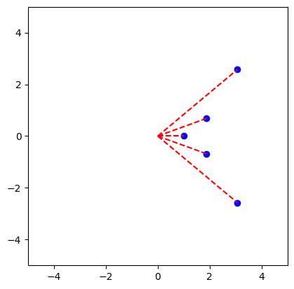
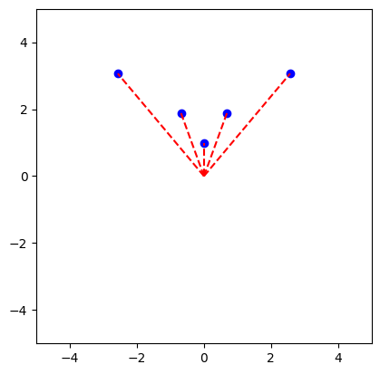

## 二次元マップをテスト
二次元マップで中心にエージェントを仮想的に配置した
10個のランダムな距離と中心からの角度を生成し、それらを点P群とした
それらの点P群は距離は0～500cm(5m)で、角度は0～360°の値をとっている
それらの点P群を二次元マップに書き込んで表示している
```Python
import numpy as np
import matplotlib.pyplot as plt

def generate_points(num_points):
    distances = np.random.uniform(0, 500, num_points)
    angles = np.random.uniform(0, 360, num_points)
    points = []
    for distance, angle in zip(distances, angles):
        x = distance * np.cos(np.deg2rad(angle))
        y = distance * np.sin(np.deg2rad(angle))
        points.append((x, y))
    return points

def plot_points(points):
    fig, ax = plt.subplots()
    ax.set_aspect('equal')
    ax.set_xlim(-550, 550)
    ax.set_ylim(-550, 550)
    ax.scatter(*zip(*points), c='b', marker='o')
    plt.show()

num_points = 20
points = generate_points(num_points)
plot_points(points)
```


さらに線を追加して中心からの距離を可視化改善
```python
import numpy as np
import matplotlib.pyplot as plt

def generate_points(num_points):
    distances = np.random.uniform(0, 500, num_points)
    angles = np.random.uniform(0, 360, num_points)
    points = []
    for distance, angle in zip(distances, angles):
        x = distance * np.cos(np.deg2rad(angle))
        y = distance * np.sin(np.deg2rad(angle))
        points.append((x, y))
    return points

def plot_points_with_lines(points):
    fig, ax = plt.subplots()
    ax.set_aspect('equal')
    ax.set_xlim(-550, 550)
    ax.set_ylim(-550, 550)

    # ポイントをプロット
    ax.scatter(*zip(*points), c='b', marker='o')

    # 中心座標を計算
    center_x, center_y = 0, 0

    # 点と中心を線で結ぶ
    for point in points:
        x, y = point
        ax.plot([center_x, x], [center_y, y], 'r--')

    plt.show()

num_points = 10
points = generate_points(num_points)
plot_points_with_lines(points)
```


プロットするプログラムの理解が進んだところで実際の知識タグの値を用いて可視化を行った。
情報は下記の通りである
| 知識名       | 角度Θ(°) | 距離r(m) | 
| ------------ | ---- | ---- | 
| 直進         | 320  | 4    | 
| 右寄りの直進 | 340  | 2    | 
| 直進         | 0    | 1    | 
| 右寄りの直進 | 20  | 2    | 
| 直進         | 40    | 4    |

その際に上記の点をプロットすると下記の通りになる
```Python
import numpy as np
import matplotlib.pyplot as plt

def generate_points():
    points = [
        (320, 4),
        (340, 2),
        (0, 1),
        (20, 2),
        (40, 4)
    ]
    converted_points = []
    for angle, distance in points:
        x = distance * np.cos(np.deg2rad(angle))
        y = distance * np.sin(np.deg2rad(angle))
        converted_points.append((x, y))
    return converted_points

def plot_points_with_lines(points):
    fig, ax = plt.subplots()
    ax.set_aspect('equal')
    ax.set_xlim(-5, 5)
    ax.set_ylim(-5, 5)

    # ポイントをプロット
    ax.scatter(*zip(*points), c='b', marker='o')

    # 中心座標を計算
    center_x, center_y = 0, 0

    # 点と中心を線で結ぶ
    for point in points:
        x, y = point
        ax.plot([center_x, x], [center_y, y], 'r--')

    plt.show()

points = generate_points()
plot_points_with_lines(points)
```


現在の状態ではプロット場所が右を見てしまっているため、すべてを+90°した値でプロットするようにした。これによりプロットが正面を向くようになった。

```Python
import numpy as np
import matplotlib.pyplot as plt

def generate_points():
    points = [
        (320, 4),
        (340, 2),
        (0, 1),
        (20, 2),
        (40, 4)
    ]
    converted_points = []
    for angle, distance in points:
        shifted_angle = angle + 90  # 角度を+90度ずらす
        x = distance * np.cos(np.deg2rad(shifted_angle))
        y = distance * np.sin(np.deg2rad(shifted_angle))
        converted_points.append((x, y))
    return converted_points

def plot_points_with_lines(points):
    fig, ax = plt.subplots()
    ax.set_aspect('equal')
    ax.set_xlim(-5, 5)
    ax.set_ylim(-5, 5)

    # ポイントをプロット
    ax.scatter(*zip(*points), c='b', marker='o')

    # 中心座標を計算
    center_x, center_y = 0, 0

    # 点と中心を線で結ぶ
    for point in points:
        x, y = point
        ax.plot([center_x, x], [center_y, y], 'r--')

    plt.show()

points = generate_points()
plot_points_with_lines(points)
```


情報を保存する必要があるため、SQLのテストを開始した。


SQLiteを使用して、データベースによる情報の保持テストを開始した。
まずはデータベースを作成するプログラムを組んだ。
その中でもテーブルが存在しない環境下のみ動作するようにププログラムを行った。<br>
```python
import sqlite3

database_file = 'database.sqlite'

# SQLiteデータベースの作成と接続
conn = sqlite3.connect(database_file)
c = conn.cursor()

# knowledgeテーブルが存在しない場合のみ作成
c.execute('''CREATE TABLE IF NOT EXISTS knowledge
             (id INTEGER PRIMARY KEY AUTOINCREMENT,
             topic TEXT,
             details TEXT)''')

# activity_valueテーブルが存在しない場合のみ作成
c.execute('''CREATE TABLE IF NOT EXISTS activity_value
             (id INTEGER PRIMARY KEY AUTOINCREMENT,
             value TEXT)''')

# データベース接続の終了
conn.close()
```


さらに、環境に変化を加え、SQLで作成するテーブルは３つ作成するようにした<br>
１つ目は、knowledgeテーブルである。このテーブルでは、選択的知識の各々の知識が持つ原点からの距離rや角度θを保持するものである。<br>
２つ目は、euclidean_distanceテーブルである。euclidean_distanceテーブルとは、知識間の活性化の値を保持するものであり、knowledgeテーブルに変更を加えた場合動作させる必要がある。<br>
３つ目は、activity_valueテーブルである。activity_valueテーブルとは、全知識の活性値を保持するテーブルである。処理が回るたびに忘却の処理を施す必要がある。活性化などで数値を変化させていくテーブルはこのテーブルである。<br>

SQLiteでdatabase.sqliteファイルを生成するようにした。
また、database.sqliteが既に存在するときは生成されないようにした。
また、作成するテーブルは３つである<br>
１つ目は、各々の知識が持つ角度と距離と活性値を保存するテーブルである。このテーブルでは、各々の知識が持つ原点からの距離rや角度θを保持するものである。また、活性値はすべて0で保存されている。さらに、説明文の列も保存している。<br>
またこれらの動作はSQL_SetUp関数にまとまられているため、SQL_SetUpで動作する。
```Python
import sqlite3

def SQL_SetUp():
    conn = sqlite3.connect('database.sqlite')
    cursor = conn.cursor()

    # データベースファイルが存在する場合は処理を終了
    cursor.execute("SELECT name FROM sqlite_master WHERE type='table'")
    existing_tables = cursor.fetchall()
    if existing_tables:
        print("Database already exists. Exiting setup.")
        conn.close()
        return

    # テーブルを作成
    cursor.execute('''
        CREATE TABLE knowledge (
            id INTEGER PRIMARY KEY AUTOINCREMENT,
            angle FLOAT,
            distance FLOAT,
            activation FLOAT DEFAULT 0,
            description TEXT
        )
    ''')

    conn.commit()
    conn.close()

# データベースのセットアップ
SQL_SetUp()
```
