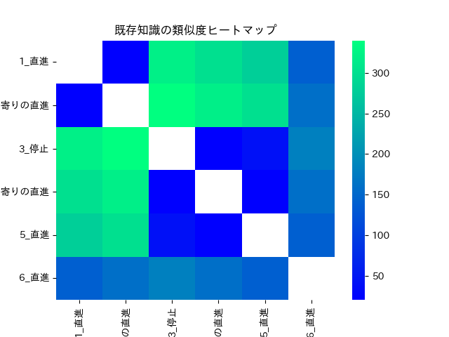

この実験は、選択的転移強化学習において転移先の強化学習済み知識が存在する状態を想定した実験である。

目的は、転移先が用意されればすぐに転移できる状態のSAP-netを準備することである。

# データの用意
前回の実験で用意したデータを取得しデータフレームに格納する
```Python
import sqlite3
import pandas as pd

def SQL_GetData():
    conn = sqlite3.connect('database.sqlite')
    cursor = conn.cursor()

    # データを取得してDataFrameに格納
    cursor.execute("SELECT * FROM knowledge")
    rows = cursor.fetchall()
    columns = [description[0] for description in cursor.description]
    df = pd.DataFrame(rows, columns=columns)

    conn.close()

    return df

# データの取得と表示
dataframe = SQL_GetData()
print(dataframe)
```


次に、idとdescriptionを結合したid_description文字列を使用して、クロス表を作成し、これを活性値テーブルとする。
また、クロス表は同値の場合1を表すが、活性値が1を超えたときその知識を選択するフラグを後に実装予定であるため、ここでは同値をNAとして扱う。

```Python
import pandas as pd

# idとdescriptionを結合した文字列を作成
df['id_description'] = df['id'].astype(str) + '_' + df['description']

# クロス表を作成
cross_table = pd.crosstab(df['id_description'], df['id_description'])
cross_table = cross_table.replace(1, np.nan)

# 新しいデータフレームを表示
print(cross_table)
```


次にクロス表に活性値を保存して計算するプログラムを追加する。

それぞれの各知識は角度と距離を持っている。
それらの角度と距離を一つのベクトルとみなし、それぞれのベクトルの差を産出することで、活性値とする。
ベクトルの差の求め方には下記のようなものがある。

1. ユークリッド距離（Euclidean Distance）は、二つのベクトル間の直線距離を計算する手法である。具体的には、各次元の差の二乗を足し合わせ、その平方根を取ることでユークリッド距離が求められる。ユークリッド距離は、ベクトル間の一般的な距離尺度として幅広く利用されている。

1. マンハッタン距離（Manhattan Distance）は、二つのベクトル間の各次元の差の絶対値の和を計算する手法である。この手法では、各次元ごとの移動量の合計を表現するため、直線距離ではなく実際の移動距離を反映します。マンハッタン距離は、位置情報や経路計画など、実際の移動に関連する問題に適用されることがある。

1. コサイン類似度（Cosine Similarity）は、ベクトル間の角度を計算し、類似性を評価する手法である。ベクトルの向きによる差異を考慮し、ベクトルの大きさに依存しないため、文書分類や類似度計算などの応用でよく利用される。コサイン類似度は、ベクトルの内積と各ベクトルの大きさの積の比率を計算することで求められます。

1. マハラノビス距離（Mahalanobis Distance）は、二つのベクトル間の異なる分散を考慮した距離を計算する手法である。この手法では、ベクトル間の共分散行列の逆行列を使用して距離を計算し、分散の異なるデータに対してより正確な距離を得ることができます。マハラノビス距離は、異常検知やクラスタリングなどの分野で利用されることがある。

この中でも今回は、ユークリッド距離を活性値の算出に採用する。

```Python
import pandas as pd
import numpy as np

#ベクトルとして角度と距離を使用するため、データを準備
vectors = df[['angle', 'distance']]

#ベクトル間のユークリッド距離を計算
distances = np.linalg.norm(vectors.values[:, np.newaxis] - vectors.values, axis=2)

#クロス表に距離を格納
cross_table = pd.DataFrame(distances, index=df['id_description'], columns=df['id_description'])
cross_table = cross_table.replace(0, np.nan)

#新しいデータフレームを表示
print(cross_table)
```


この値を０～１にスケーリングし、活性化の値に使用する。
また、具体的なスケーリング手法としては、最大値を用いて簡易的に算出している。
ここの正規化については後ほどしっかりと教授と議論して話を進めたい。

```python
import numpy as np

# ユークリッド距離を評価する指標を計算する関数
def evaluate_distance(distance):
    max_distance = np.nanmax(cross_table.values)  # ユークリッド距離の最大値（NaNを除く）
    scaled_distance = distance / max_distance  # ユークリッド距離を最大値でスケーリング
    evaluation = 1 - scaled_distance  # 1からスケーリングされた距離を引く
    return evaluation

# ユークリッド距離の評価指標を計算し、再度DataFrameに格納
evaluated_values = cross_table.applymap(evaluate_distance)
df = evaluated_values.copy()

# 再度dfを表示
print(df)
```


また、何度も加算され活性化された値を採用したいため、さらにスケーリング後の値を1/10にしている。
```Python
import numpy as np

# ユークリッド距離を評価する指標を計算する関数
def evaluate_distance(distance):
    max_distance = np.nanmax(cross_table.values)  # ユークリッド距離の最大値（NaNを除く）
    scaled_distance = distance / max_distance  # ユークリッド距離を最大値でスケーリング
    evaluation = 1 - scaled_distance  # 1からスケーリングされた距離を引く
    return evaluation

# ユークリッド距離の評価指標を計算し、再度DataFrameに格納
evaluated_values = cross_table.applymap(evaluate_distance)
activation_table = evaluated_values.copy()

# 評価指標を1/10にスケーリング
activation_table_div10 = activation_table / 10
activation_table_min1 = 1-activation_table


# 再度activation_tableを表示
print(activation_table_div10)
```


結果として類似度はヒートマップやネットワークで表すと下記の通り。
```python
import seaborn as sns
import pandas as pd
import numpy as np
import matplotlib as mpl
import matplotlib.pyplot as plt
import japanize_matplotlib


plt.figure()
plt.title("既存知識の類似度ヒートマップ")
sns.heatmap(activation_table_div10,cmap="winter")
plt.savefig(Heatmap_path)
plot_points()
```



```python
import pandas as pd
import networkx as nx
import matplotlib.pyplot as plt
import japanize_matplotlib

G = nx.from_pandas_adjacency(activation_table_min1, create_using=nx.Graph)

# グラフの描画
pos = nx.circular_layout(G)  # レイアウトアルゴリズムをcircular_layoutに変更
weights = nx.get_edge_attributes(G, 'weight')

# エッジの太さを制限
max_weight = max(weights.values())
edge_widths = [(6 * (1 - weights[edge])) ** 2 for edge in G.edges()]
# エッジの太さの最大値を制限
max_edge_width = 3.0
edge_widths = [min(width, max_edge_width) for width in edge_widths]

# ノードの太さを制限
node_sizes = [50 + 150 * G.degree(node) for node in G.nodes()]
# ノードのサイズの最大値を制限
max_node_size = 1000
node_sizes = [min(size, max_node_size) for size in node_sizes]

# グラフを描画
japanize_matplotlib.japanize()
# 一部のエッジのみ描画
edges_to_draw = [(u, v) for (u, v) in G.edges if weights[(u, v)] > 0.5]
nx.draw_networkx_nodes(G, pos, node_color='lightblue', node_size=node_sizes)
nx.draw_networkx_edges(G, pos, edgelist=edges_to_draw, width=edge_widths, edge_color='black')
nx.draw_networkx_labels(G, pos, font_family='IPAexGothic', font_color='black', font_size=10)
plt.title("既存知識の類似度ネットワーク")
plt.axis('off')

# グラフを出力
plt.savefig(Network_path)
plt.show()  # グラフを表示するための追加行
```


次に、SAP-netに障害物の場所を受け付けるプログラムの作成
```Python
# 障害物レコードを追加
new_id = len(df) + 1
new_activation = 0.0
new_description = '障害物'
new_angle = float(input('角度を入力してください: '))
new_distance = float(input('距離を入力してください: '))

new_data = pd.DataFrame({
    'id': [new_id],
    'activation': [new_activation],
    'description': [new_description],
    'angle': [new_angle],
    'distance': [new_distance]
})

input_df = pd.concat([df, new_data], ignore_index=True)

print(input_df)
```


また、プログラムを繰り返す際に、SQL_InserDataが複数回繰り返されると、永遠に既定のデータが追加されてしまうバグを修正しました。
下記の修正により、既にデータベースが存在しSetUpが済んでいる場合、「Database already exists. Exiting setup「」と表示しfunctionを終了させます。。
```Python
import sqlite3

def SQL_SetUp():
    conn = sqlite3.connect('database.sqlite')
    cursor = conn.cursor()

    # データベースファイルが存在する場合は処理を終了
    cursor.execute("SELECT name FROM sqlite_master WHERE type='table'")
    existing_tables = cursor.fetchall()
    if existing_tables:
        print("Database already exists. Exiting setup.")
        conn.close()
        return

    # テーブルを作成
    cursor.execute('''
        CREATE TABLE knowledge (
            id INTEGER PRIMARY KEY AUTOINCREMENT,
            angle FLOAT,
            distance FLOAT,
            activation FLOAT DEFAULT 0,
            description TEXT
        )
    ''')

    data = [
        ("直進", 320, 4, 0),#１番の知識
        ("左寄りの直進", 340, 2, 0),#２番の知識
        ("右寄りの直進", 0, 1, 0),#１番の知識
        ("右寄りの直進", 20, 2, 0),#１番の知識
        ("直進", 40, 4, 0)#１番の知識
    ]

    conn = sqlite3.connect('database.sqlite')
    cursor = conn.cursor()

    # データを挿入
    cursor.executemany("INSERT INTO knowledge (description, angle, distance, activation) VALUES (?, ?, ?, ?)", data)


    conn.commit()
    conn.close()

# データベースのセットアップ
SQL_SetUp()
```
また、上記のテーブルから、障害物との類似度を算出し活性値の取り出しに成功した。
```python
print(activation_table_div10)
print()
activity_value_temp = activation_table_div10.loc['1_直進', '2_左寄りの直進']

# 結果を表示
print(subset)
```


番号が対応しているかいま一度確認した


最後は一気にSAP-netを作成した。
（学会の論文投稿が迫っているため説明を省く）
```Python
import sqlite3
import pandas as pd
import sqlite3
import matplotlib.pyplot as plt
from PIL import Image  # Import the PIL module
import io
from IPython.display import HTML
from IPython.display import display
from PIL import Image  # Import the PIL module
import glob  # Import the glob module
import japanize_matplotlib


for i in range(len(activation_table_div10.columns)-1):
    print(activation_table_div10.columns[i], activation_table_div10.columns[-1])
    activity_value_temp = activation_table_div10.loc[activation_table_div10.columns[i], activation_table_div10.columns[-1]]
    input_df2.loc[input_df2['id_description'] == activation_table_div10.columns[i], 'activation'] += activity_value_temp

# 画像を格納するリスト
images = []

while not (input_df2['activation'] > 1).any():
    for i in range(len(activation_table_div10.columns)):
        for j in range(len(activation_table_div10.columns)):
            if i==j:
                continue
            activity_value_temp = activation_table_div10.loc[activation_table_div10.columns[i], activation_table_div10.columns[j]]
            input_df2.loc[input_df2['id_description'] == activation_table_div10.columns[i], 'activation'] += activity_value_temp
            print(input_df2)

            plt.barh(input_df2['id_description'], input_df2['activation'])
            
            # グラフのタイトルと軸ラベルの設定
            plt.title('Activation by ID Description')
            plt.xlabel('Activation')
            plt.ylabel('ID Description')
            
            # 画像の保存と追加
            buf = io.BytesIO()
            plt.savefig(buf, format='png')
            buf.seek(0)
            im = Image.open(buf)
            images.append(im)
            plt.clf()  # Clear the figure for the next iteration


# GIF画像の保存
images[0].save(GIF_path_100, format='GIF', append_images=images[1:], save_all=True, duration=100, loop=0)
images[0].save(GIF_path_1000, format='GIF', append_images=images[1:], save_all=True, duration=1000, loop=0)
```


さらに最後のループをすべて画像に保存しているため、Gif画像を表示できる。
選択される様子は以下の通り。
```Python
# GIF画像の表示
with open(GIF_path_100, "rb") as f:
    b64 = base64.b64encode(f.read()).decode("ascii")
    
display(dd.HTML(f''))
```


しかし、図が障害物の活性値を表示するため、可視化性能が下がっていることがわかる。
そのため、プロットをとる、部分をスライスして実行
```Python
import sqlite3
import pandas as pd
import sqlite3
import matplotlib.pyplot as plt
from PIL import Image  # Import the PIL module
import io
from IPython.display import HTML
from IPython.display import display
from PIL import Image  # Import the PIL module
import glob  # Import the glob module
import japanize_matplotlib

for i in range(len(activation_table_div10.columns)-1):
    print(activation_table_div10.columns[i], activation_table_div10.columns[-1])
    activity_value_temp = activation_table_div10.loc[activation_table_div10.columns[i], activation_table_div10.columns[-1]]
    input_df2.loc[input_df2['id_description'] == activation_table_div10.columns[i], 'activation'] += activity_value_temp

# 画像を格納するリスト
images = []

while not (input_df2['activation'] > 1).any():
    for i in range(len(activation_table_div10.columns)):
        for j in range(len(activation_table_div10.columns)):
            if i==j:
                continue
            activity_value_temp = activation_table_div10.loc[activation_table_div10.columns[i], activation_table_div10.columns[j]]
            input_df2.loc[input_df2['id_description'] == activation_table_div10.columns[i], 'activation'] += activity_value_temp
            print(input_df2)

            plt.barh(input_df2['id_description'][0:5], input_df2['activation'][0:5])
            
            # グラフのタイトルと軸ラベルの設定
            plt.title('Activation by ID Description')
            plt.xlabel('Activation')
            plt.ylabel('ID Description')
            
            # 画像の保存と追加
            buf = io.BytesIO()
            plt.savefig(buf, format='png')
            buf.seek(0)
            im = Image.open(buf)
            images.append(im)
            plt.clf()  # Clear the figure for the next iteration


# GIF画像の保存
images[0].save(GIF_path_100, format='GIF', append_images=images[1:], save_all=True, duration=100, loop=0)
images[0].save(GIF_path_1000, format='GIF', append_images=images[1:], save_all=True, duration=1000, loop=0)
```
再度スライス後のデータを用いてGif画像を表示する。
選択される様子は以下の通り。

```Python
# GIF画像の表示
with open(GIF_path_100, "rb") as f:
    b64 = base64.b64encode(f.read()).decode("ascii")
    
display(dd.HTML(f''))
```

